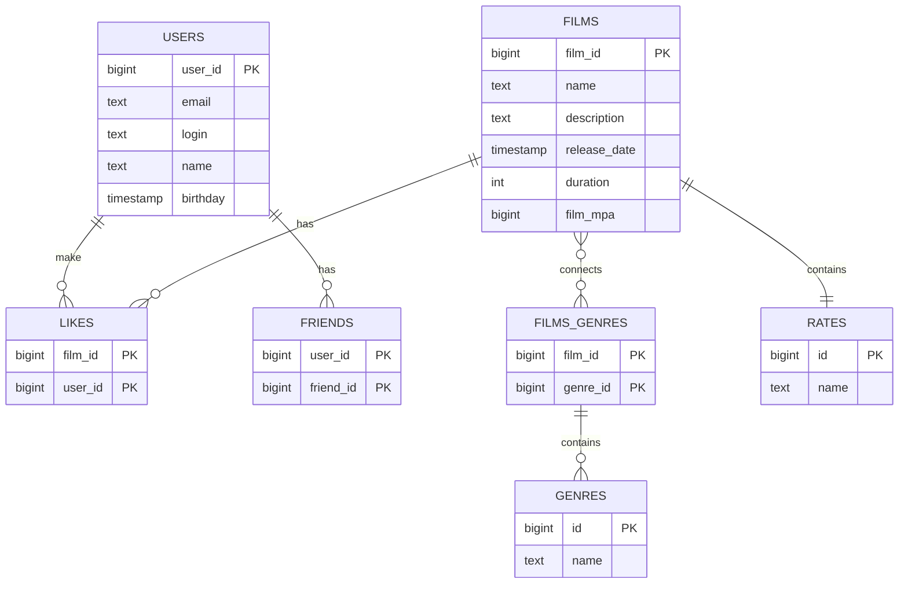

# java-filmorate
Template repository for Filmorate project.


## Примеры запросов для базы данных:
#### **1. Просмотр всех фильмов**
```
SELECT id,
       name,
       description,
       releaseDate,
       duration
FROM films;
```
#### **2. Просмотр всех пользователей**
```
SELECT id,
       name,
       login,
       email,
       birthday
FROM users;
```